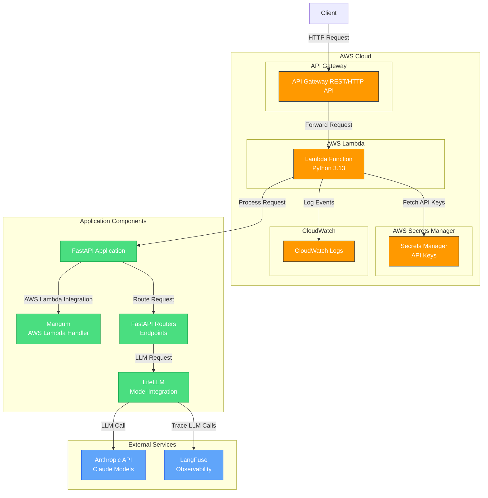

# GenAI on AWS

A production-ready GenAI application framework on AWS using a serverless architecture.

## Overview

This repository provides a complete solution for deploying GenAI applications on AWS with:

- FastAPI backend running on AWS Lambda
- API Gateway for HTTP endpoints
- Anthropic/Claude integration (with support for other LLMs via LiteLLM)
- Infrastructure as Code using Pulumi
- LangFuse for observability and tracing
- Comprehensive testing and development tools

## Architecture Diagram



## Repository Structure

- `api/` - FastAPI application code
  - `gen_ai_on_aws/` - Main application
  - `build/` - Build artifacts
- `worker/` - Lambda worker code for async processing
  - `worker/` - Main worker logic
  - `build/` - Build artifacts
- `provisioning/` - Pulumi IaC for AWS resources
- `specs/` - AI Coding prompt
- `ai-docs/` - Reference documentation for AI coding, scraped with Firecrawl MCP (Model Context Protocol)

Each directory has its own dependency set (pyproject.toml). Root dependencies enforce consistent standards across the repository.

## Prerequisites

- [uv](https://docs.astral.sh/uv/getting-started/installation/) - Python version and package manager
- [Docker](https://docs.docker.com/engine/install/) - Required for building Lambda packages
- [httpie](https://httpie.io/cli) - Modern HTTP client (optional but recommended)
- AWS Account with appropriate permissions
- Anthropic API key (if using Claude)

## Deployment

### 1. Build the Lambda Packages

The project provides flexible options for building Lambda deployment packages:

```bash
# Option 1: Build both API and worker packages from repository root
./build_lambda_packages.sh

# Option 2: Build only the API package
./api/build_lambda_package.sh

# Option 3: Build only the worker package (with optional version)
./worker/build_lambda_package.sh [version]
```

These scripts can be run from either the repository root or their respective directories. The API package uses the git commit hash for versioning, while the worker package uses either the provided version parameter or a timestamp.

This creates deployment packages at:
- API: `api/build/packages/api-package-<git-hash>.zip`
- Worker: `worker/build/packages/worker-package-<version>.zip`

### 2. Provision AWS Infrastructure

```bash
cd provisioning
uv run pulumi login --local  # Store state locally (can also use S3/Pulumi Cloud)
export PULUMI_CONFIG_PASSPHRASE="your-passphrase"  # For state file encryption
export AWS_DEFAULT_REGION=us-east-1
export PULUMI_STACK=dev
uv run pulumi stack init $PULUMI_STACK
```

### 3. Configure AWS Credentials

```bash
export AWS_ACCESS_KEY_ID="YOUR_ACCESS_KEY"
export AWS_SECRET_ACCESS_KEY="YOUR_SECRET_KEY"
export AWS_SESSION_TOKEN="YOUR_SESSION_TOKEN"  # If using temporary credentials
```

### 4. Store API Keys Securely

```bash
aws secretsmanager create-secret \
  --secret-string '{"key": "sk-ant-your-key"}' \
  --name "gen-ai-on-aws/$PULUMI_STACK/anthropic_api_key"
```

### 5. Deploy Resources

```bash
uv run pulumi up -y
```

### 6. Test the Deployment

```bash
http POST $(pulumi stack output apigateway-rest-endpoint)"/examples/extract-user" \
  text="My name is Bob, I am 40 years old"
```

### 7. Monitor Lambda Logs

```bash
aws logs tail --follow /aws/lambda/$(pulumi stack output lambda_function_name)
```

## Advanced Configuration

### LangFuse Integration

```bash
aws secretsmanager create-secret \
  --secret-string '{"key": "pk-lf-xxx"}' \
  --name "gen-ai-on-aws/$PULUMI_STACK/langfuse_public_key"

aws secretsmanager create-secret \
  --secret-string '{"key": "sk-lf-xxx"}' \
  --name "gen-ai-on-aws/$PULUMI_STACK/langfuse_secret_key"
```

## Local Development

### Run the FastAPI Server

```bash
cd app
uv run uvicorn gen_ai_on_aws.main:app --reload
```

### Test the API Locally

```bash
http POST http://0.0.0.0:8000/examples/extract-user \
  text="My name is Bob, I am 40 years old, bb@gmail.com"
```

### Running Tests

```bash
cd app
uv run pytest                        # Run all tests
uv run pytest -v                     # Verbose output
uv run pytest --cov=gen_ai_on_aws    # Test coverage
```

Generate HTML coverage report:
```bash
uv run pytest --cov=gen_ai_on_aws && uv run coverage html && open htmlcov/index.html
```

## Roadmap

- ✅ FastAPI application with routers
- ✅ Lambda packaging 
- ✅ Anthropic/Bedrock integration
- ✅ LangFuse tracing
- ✅ Unit testing
- ✅ Architecture diagram
- ⬜ SQS queue and worker processing
- ⬜ LLM chain/pattern examples
- ⬜ RAG with Aurora PostgreSQL
- ⬜ Enhanced monitoring and alarms
- ⬜ CI/CD with GitHub Actions
- ⬜ Lambda layers optimization
- ⬜ Progressive deployments
- ⬜ Frontend implementation

## License

See the [LICENSE](LICENSE) file for details.