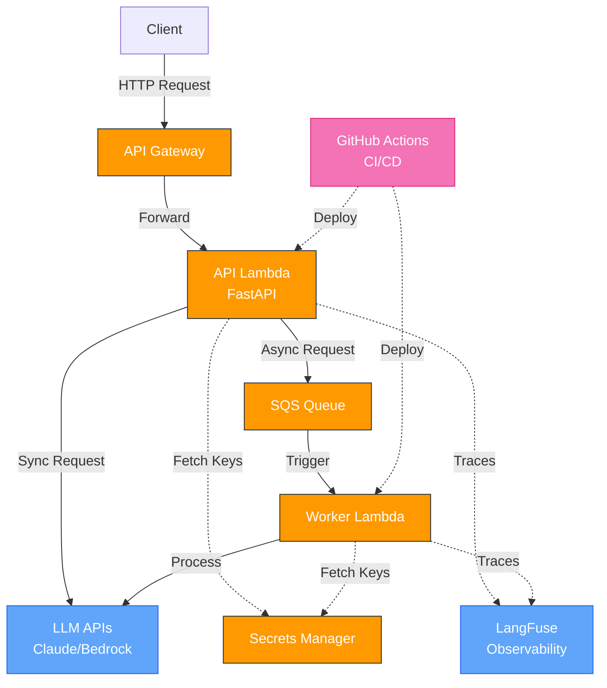

# GenAI on AWS

[](https://github.com/yorrickjansen/gen-ai-on-aws/actions/workflows/ci.yml)
[](https://codecov.io/gh/yorrickjansen/gen-ai-on-aws)

A production-ready GenAI application framework on AWS using a serverless architecture, for minimal maintenance & cost, and maximum scalability.

## Overview

This repository provides a complete solution for deploying GenAI applications on AWS with:

- FastAPI backend running on AWS Lambda
- API Gateway for HTTP endpoints
- Anthropic/Claude integration (with support for other LLMs via LiteLLM)
- Infrastructure as Code using Pulumi
- LangFuse for observability and tracing
- Comprehensive testing and development tools

## Architecture Diagram



## Repository Structure

- `api/` - FastAPI application code
  - `gen_ai_on_aws/` - Main application
  - `build/` - Build artifacts
- `worker/` - Lambda worker code for async processing
  - `worker/` - Main worker logic
  - `build/` - Build artifacts
- `provisioning/` - Pulumi IaC for AWS resources
- `specs/` - AI Coding prompt
- `ai-docs/` - Reference documentation for AI coding, scraped with Firecrawl MCP (Model Context Protocol)
- `docs/` - Project documentation
  - `monitoring.md` - Monitoring and alerting setup documentation
- `.github/workflows/` - CI/CD pipeline configurations

Each directory has its own dependency set (pyproject.toml). Root dependencies enforce consistent standards across the repository.

## Prerequisites

- [uv](https://docs.astral.sh/uv/getting-started/installation/) - Python version and package manager
- [Docker](https://docs.docker.com/engine/install/) - Required for building Lambda packages
- [httpie](https://httpie.io/cli) - Modern HTTP client (optional but recommended)
- AWS Account with appropriate permissions
- Anthropic API key (if using Claude)

## Deployment

TLDR

```bash
./build_lambda_packages.sh; and ./run_pulumi.sh up -y
```

### 1. Build the Lambda Packages

The project uses **Lambda layers** to separate dependencies from application code, enabling fast deployments and efficient caching.

```bash
# Option 1: Build both API and worker packages from repository root
./build_lambda_packages.sh

# Option 2: Build only the API package
./api/build_lambda_package.sh

# Option 3: Build only the worker package
./worker/build_lambda_package.sh
```

These scripts can be run from either the repository root or their respective directories.

**What gets built:**

Each build creates two artifacts:

1. **Lambda Layer** (dependencies only) - Cached by hash of `uv.lock`
   - API: `api/build/layers/<hash>-api-libs.zip`
   - Worker: `worker/build/layers/<hash>-worker-libs.zip`
   - Only rebuilt when dependencies change (detected via `uv.lock` hash)

2. **Application Package** (code only) - Built every time
   - API: `api/build/packages/api-<git-hash>.zip`
   - Worker: `worker/build/packages/worker-<git-hash>.zip`
   - Small and fast to deploy (~KB vs ~MB)

**Layer Caching:**
- Layers are named using a hash of the `uv.lock` file
- If the hash matches an existing layer (locally or in AWS), it's reused
- Dependencies typically change rarely, so most deployments skip the layer build
- This dramatically speeds up iterative development and CI/CD

### 2. Provision AWS Infrastructure

```bash
cd provisioning
uv run pulumi login --local  # Store state locally (can also use S3/Pulumi Cloud)
export PULUMI_CONFIG_PASSPHRASE="your-passphrase"  # For state file encryption
export AWS_DEFAULT_REGION=us-east-1
export PULUMI_STACK=dev
uv run pulumi stack init $PULUMI_STACK
```

### 3. Configure AWS Credentials

```
aws sso login --profile <profile>
```

With `~/.aws/config`

```
[profile <org-name>-prod]
sso_session = <org-name>
sso_account_id = <account-id>
sso_role_name = AWSAdministratorAccess
region = eu-central-1
login_session = arn:aws:sts::<account-id>:assumed-role/AWSReservedSSO_AWSAdministratorAccess_123456/<user-name>

[sso-session <org-name>]
sso_start_url = https://<org-name>.awsapps.com/start/
sso_region = eu-central-1
sso_registration_scopes = sso:account:access
```

```bash
export AWS_ACCESS_KEY_ID="YOUR_ACCESS_KEY"
export AWS_SECRET_ACCESS_KEY="YOUR_SECRET_KEY"
export AWS_SESSION_TOKEN="YOUR_SESSION_TOKEN"  # If using temporary credentials
```

### 4. Store API Keys Securely

```bash
aws secretsmanager create-secret \
  --secret-string '{"key": "sk-ant-your-key"}' \
  --name "gen-ai-on-aws/$PULUMI_STACK/anthropic_api_key"
```

### 5. Deploy Resources

```bash
# ./build_lambda_packages.sh just for first "pulumi up"
uv run pulumi up -y
```

### 6. Test the Deployment

```bash
http POST $(pulumi stack output apigatewayv2-http-endpoint)"examples/extract-user" \
  text="My name is Bob, I am 40 years old"
```

### 7. Monitor Lambda Logs

```bash
aws logs tail --follow /aws/lambda/$(pulumi stack output lambda_function_name)
```

## Manual Redeployment

After making code changes, you can manually redeploy without using the CI/CD pipeline:

### Quick Redeploy

```bash
# From repository root
./api/build_lambda_package.sh && \
./worker/build_lambda_package.sh && \
cd provisioning && \
uv run pulumi up -y
```

### Step-by-Step Redeploy

```bash
# 1. Build new Lambda packages (creates versioned zip files)
./api/build_lambda_package.sh       # Creates api-package-<git-hash>.zip
./worker/build_lambda_package.sh    # Creates worker-package-<git-hash>.zip

# 2. Preview changes (optional)
cd provisioning
uv run pulumi preview

# 3. Deploy updates
uv run pulumi up -y
```

### How Version Detection Works

Pulumi automatically detects new code versions using the build artifacts:

- **API Package**: `api/build/packages/api-<git-hash>.zip`
  - Version is based on the current git commit SHA
  - Appends `-SNAPSHOT` if there are uncommitted changes

- **Worker Package**: `worker/build/packages/worker-<git-hash>.zip`
  - Version is based on the current git commit SHA
  - Appends `-SNAPSHOT` if there are uncommitted changes

- **Lambda Layers**: `api/build/layers/<hash>-api-libs.zip` and `worker/build/layers/<hash>-worker-libs.zip`
  - Layer names are based on SHA256 hash of `uv.lock` file
  - Pulumi checks if layer exists in AWS by name
  - If exists → reuses it; if not → publishes new layer version
  - Dependencies rarely change, so layers are typically reused

When you run `pulumi up`:
1. Pulumi checks the `app_version` config (default: `latest`)
2. If set to `latest`, it finds the newest zip file by timestamp
3. Checks if Lambda layers exist in AWS (by hash-based name)
4. Publishes layers only if they don't exist
5. Updates Lambda function code with the new package and layer ARNs

### Deploy to Specific Stack

```bash
cd provisioning

# Switch to a different stack
uv run pulumi stack select dev    # or demo, prod, yorrick

# Deploy to that stack
uv run pulumi up -y
```

### Deploy Specific Version

```bash
cd provisioning

# Deploy a specific git commit version
uv run pulumi config set app_version abc123f
uv run pulumi config set worker_version abc123f
uv run pulumi up -y

# Or go back to latest
uv run pulumi config set app_version latest
uv run pulumi config set worker_version latest
uv run pulumi up -y
```

**Note:** Manual deployment is useful for development and testing. For production deployments, use the CI/CD pipeline for better traceability and rollback capabilities.

## Advanced Configuration

### Monitoring Email Notifications

To enable email notifications for CloudWatch alarms, add the `monitoring_email` parameter to your Pulumi config:

```bash
cd provisioning
pulumi config set monitoring_email your.email@example.com
```

This will create an SNS topic and subscription that sends notifications for all alarms when they enter ALARM or OK states.

### LangFuse Integration

```bash
aws secretsmanager create-secret \
  --secret-string '{"key": "pk-lf-xxx"}' \
  --name "gen-ai-on-aws/$PULUMI_STACK/langfuse_public_key"

aws secretsmanager create-secret \
  --secret-string '{"key": "sk-lf-xxx"}' \
  --name "gen-ai-on-aws/$PULUMI_STACK/langfuse_secret_key"
```

## Cost Considerations

The serverless architecture of this solution minimizes costs while maintaining scalability:

| AWS Service | Cost Factors | Optimization |
|-------------|--------------|--------------|
| Lambda | $0.0000166667/GB-s, $0.20/1M requests | 128MB-256MB memory, cold start <100ms |
| API Gateway | $1.00/1M requests | HTTP API is cheaper than REST API |
| SQS | $0.40/1M requests | Standard queue for most use cases |
| Secrets Manager | $0.40/secret/month, $0.05/10K API calls | Reuse secrets across environments |
| CloudWatch | $0.30/GB ingest, $0.03/1M metrics | Filter logs, adjust retention |

**Estimated Monthly Cost (low-volume):**
* 100K requests: ~$1-3/month + LLM API costs
* No always-on resources means no idle costs

## Local Development

### Run the FastAPI Server

```bash
cd api
uv run uvicorn gen_ai_on_aws.main:app --reload
```

### Test the API Locally

```bash
http POST http://0.0.0.0:8000/examples/extract-user \
  text="My name is Bob, I am 40 years old, bb@gmail.com"
```

### Running Tests

```bash
cd api
uv run pytest                        # Run all tests
uv run pytest -v                     # Verbose output
uv run pytest --cov=gen_ai_on_aws    # Test coverage
```

Generate HTML coverage report:
```bash
uv run pytest --cov=gen_ai_on_aws && uv run coverage html && open htmlcov/index.html
```

## CI/CD Pipeline

This project uses GitHub Actions for continuous integration and deployment with environment-specific configurations:

### Pipeline Overview

1. **Triggers:**
   - Automatically runs on push to main branch
   - Automatically runs on pull requests to main branch
   - Manual trigger via workflow dispatch with environment selection (dev/demo)

2. **CI Workflow:**
   - **Lint:** Code quality checks with ruff, isort, and other tools
   - **Test API:** API unit tests with pytest and codecov integration
   - **Test Worker:** Worker unit tests with pytest and code coverage
   - **Test API Start:** Verifies API can start and serve requests
   - **Test Pulumi:** Tests infrastructure code with Pulumi
   - **Build:** Creates Lambda deployment packages for API and worker

3. **CD Workflow:**
   - Runs automatically when code is pushed to `main` (dev environment) or `releases/demo` (demo environment)
   - Uses AWS OIDC authentication for secure access to AWS resources
   - Downloads Lambda packages and layers built by the CI workflow
   - Deploys the infrastructure using Pulumi (publishes layers only if needed)
   - Fast deployments: app code updates in seconds, layers cached by hash

4. **AWS Authentication:**
   - Uses OIDC (OpenID Connect) for secure authentication to AWS
   - Environment-specific AWS account IDs for multi-account deployments
   - IAM role "github-actions" with controlled permissions

5. **Environment Configuration:**
   - Environment-specific secrets for AWS credentials and API keys
   - GitHub Environments for "dev" and "demo" with appropriate protection rules
   - Pulumi stacks named after environments for infrastructure management

### CI/CD Setup Instructions

1. **Configure AWS OIDC Integration:**
   ```bash
   # Set the GitHub repository in Pulumi config
   cd provisioning
   pulumi config set github_repo "your-org/your-repo"
   pulumi up
   ```

2. **Configure GitHub Secrets:**
   - `AWS_ROLE_TO_ASSUME`: The ARN of the role created by Pulumi
   - `AWS_REGION`: The AWS region to deploy to (e.g., `us-east-1`)
   - `PULUMI_PASSPHRASE`: A passphrase for encrypting the Pulumi state
   - `CODECOV_TOKEN`: Token for uploading coverage reports (optional)

3. **Branch Protection Rules:**
   - Require status checks to pass before merging
   - Require review before merging
   - Do not allow bypassing the above settings

See the [CI/CD workflow files](.github/workflows/) for detailed configuration.

## Security & Code Quality

### Pre-commit Hooks

The project uses pre-commit hooks to maintain code quality and security:

- **Ruff** - Fast Python linter and formatter
- **isort** - Import sorting (Black-compatible)
- **pyupgrade** - Automatic Python syntax upgrades
- **Claude Code Secrets Scanner** - AI-powered detection of sensitive data ⚡

### Secrets Scanner

An AI-powered pre-commit hook scans for sensitive data before each commit:

**Detects:**
- API keys and tokens (AWS, OpenAI, Anthropic, GitHub, Stripe, etc.)
- Database credentials and connection strings
- Private keys and certificates (PEM blocks, SSH keys)
- Passwords and cryptographic secrets
- Personally Identifiable Information (PII)

**Features:**
- Smart detection that distinguishes real secrets from placeholders
- Blocks commits with high-risk findings (private keys, real credentials)
- Allows low-risk findings with warnings
- Gracefully skips if Claude Code CLI is not installed

**Requirements:**
- [Claude Code CLI](https://claude.com/claude-code) installed locally
- Not required for CI/CD (hook auto-skips if not available)

**Bypass (not recommended):**
```bash
git commit --no-verify
```

**Install Claude Code:**
```bash
# See https://claude.com/claude-code for installation
```

## Roadmap

- ✅ FastAPI application with routers
- ✅ Lambda packaging 
- ✅ Anthropic/Bedrock integration
- ✅ LangFuse tracing
- ✅ Unit testing
- ✅ Architecture diagram
- ✅ SQS queue and worker processing
- ✅ CI/CD with GitHub Actions
- ✅ Codecov integration
- ✅ Monitoring, alerting ([docs](docs/monitoring.md))
- ✅ Lambda layers optimization for faster deployments
- ⬜ tracing, backups, with optional integration with Incidents Manager / Incident.io
- ⬜ LLM chain/pattern examples
- ⬜ Demo of n8n integration
- ⬜ Dynamic loading of prompt using Langfuse, for faster experimentation
- ⬜ RAG with Aurora PostgreSQL
- ⬜ VPC setup for Lambda functions and Aurora PostgreSQL
- ⬜ PII data handling (log retention, masking, etc.)
- ⬜ Cost tracking and alerts
- ⬜ Demo of Bedrock, Kendra, Lex, etc... integration
- ⬜ Custom domain name, SSL certificate, IP whitelisting, usage plans to restrict access to API
- ⬜ Progressive deployments for improved reliability in production (using CodeDeploy, triggered from GH Actions)
- ⬜ Frontend implementation for demo (optional websocket push)
- ⬜ Scaling configuration for Lambda functions (concurrency, memory, timeout)

## License

See the [LICENSE](LICENSE) file for details.

